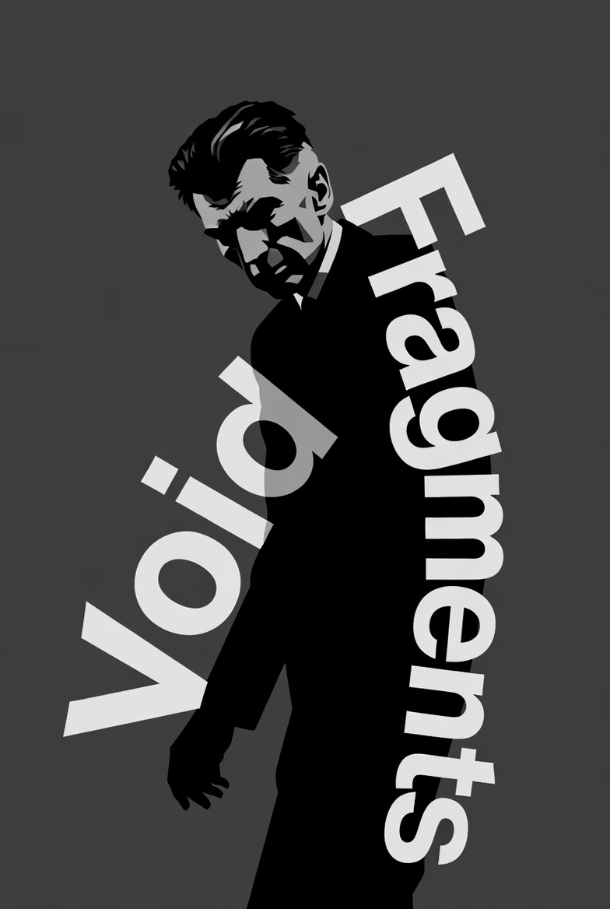
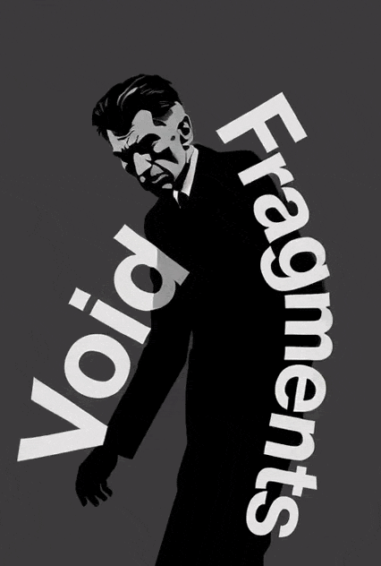

<p align="center">
  
</p>

# Void Fragments
**Smells Like Beckett Spirit.**

*A Beckettian Text Generator for NaNoGenMo 2025*

A procedural text generator **inspired** by Samuel Beckett’s *Texts for Nothing*.

This program produces a continuous, fragmented monologue that echoes Beckett’s late style:
- voice without a body
- speech that circles around silence
- repetition without progress
- questions without answers
- the obligation to speak despite having nothing to say

The output is a single text file (`Void-Fragments-(Date-Time).txt`), structured in **six generative modes**, each capturing a distinct tonality from *Texts for Nothing* (1–13):

- **Mode A**: Raw lexical shards — sparse, aphoristic fragments (Texts 1–5)
- **Mode B**: Interrogative vertigo — obsessive doubt, modal paralysis (Texts 6, 10–11)
- **Mode C**: Continuous murmuring — flowing recursive voice (Text 13)
- **Mode D**: Compulsive repetition — looping phrases, “again the same” (Texts 3, 5, 7)
- **Mode E**: Pure negation — impossibility, aporia, “cannot” (Texts 2, 4, 8)
- **Mode F**: Anatomy of absence — catalogues of deprivation (“no body, no name…”) (Texts 1, 6, 9)

All sentences are either drawn from a curated set of *original meta-phrases* or *generated through constrained templates* using weighted lexical choices (nouns, verbs, adverbs) consistent with *Beckett’s thematic universe*.

> **No text from Beckett’s published works is reproduced verbatim.**

## 📖 Output Sample

No thought, no light, and yet speak  
No will, and yet he knows  
No space, and yet it speaks  

is it too late?  
is this the beginning?  
Is being silent enough?  
who am I speaking to?  

I must go on, I cannot go on, I’ll go on  
to be there, not to be there, to be all the same  
I cannot speak, I speak, I cannot be silent  

again this  
it’s the same thing, again the same, always the same  
speak, speak again, always speak, to say nothing  

Impossible to speak, yet one continues  
One should continue, but continue changes nothing  
I cannot stay, I go stay  

Without eye, without face, without name, and yet I stay  
Neither dust, nor space, nor even the shadow of chair  
No mouth, no breath, and yet is silent  

One should whisper, but she cannot whisper  
Impossible to can, yet she continues  
Not to speak, never to speak, and yet speak  
He cannot repeat, he goes repeat  
One should know, but know changes nothing

To continue or not to continue, makes no difference  
One should continue, but one cannot  
He wants to have, but cannot  
Must one mean, even without sense?

She does not know if she speaks, but she speaks  
Who continues? one, perhaps, or no one  
Who continues? it, perhaps, or no one  
Is understanding enough?

Who speaks? me, perhaps, or someone else  
does she persist, or is it silence?

I cannot speak, I speak, I cannot be silent  
She wants to persist, but cannot  
One should have, but one cannot  
One wants to feel, but cannot  
is that enough?

She looks for a word, but finds no word  
No voice, and yet she stays  
She speaks, without eye, without place, without knowing why  
to be silent is to speak, but to speak is to fail  
does it mean anything?

He speaks without past, without future, without present  
It stays, it does not know why  
Is it simply over?  
No memory, no word, and yet have  
not there, and yet there, always there

One would like to can, but can is not possible  
One tries to stay, but stay is impossible  
One continues to say nothing, that’s already something  
It looks for a shadow, but finds no shadow  
without memory, without trace, and yet I know
I look for a word, but finds no word  

I look for a time, but find nothing  
I look for a memory, but find nothing  
There is a voice that waits, that’s all one knows

He is not there, he is somewhere there  
She is without past, without future, without present  
He is there, always there, dumbly there  
and after that?  
one ought to fall silent, but silence speaks

One continues, without presence, without mind, without knowing why  
Do I whisper, or is it silence?  
after that?  
Somewhere here, already there, dumbly nowhere, and she is  
It cannot be silent, it goes be silent

## ▶️ How to Run
```bash
python Void-Fragments.py
```
Then, copy Void-Fragments.md into the book/ directory and run makebook.bat from within that directory to generate the PDF using Pandoc & MiKTeX.
(Make sure source.py — the ASCII-safe source code — is in the book/ directory.)


## Afterword

*Void Fragments* is the fruit of a Python-based procedural monologue generator inspired by Samuel Beckett’s *Texts for Nothing*. It is not a program output in the technical sense, but a literary work born from algorithmic composition—an autonomous voice that speaks without body, circles around silence, and persists despite having nothing to say.  
The text unfolds through six generative modes: aphoristic shards, obsessive questioning, compulsive repetition, pure negation, catalogues of absence, and murmuring continuities. These modes echo Beckett’s late prose not by imitation, but by resonance—reconstructing his existential cadence through original templates, curated fragments, and stochastic rhythm.  
No sentence is copied from Beckett’s published works. Every line is generated from scratch using a system of linguistic constraints, weighted lexicons, and poetic filters. The source code that produced this volume is included in the appendix not as documentation, but as a score: a set of instructions for a voice that cannot stop, even when it has nothing left to utter.  
— Joe ApocaLips, November 2025.  

##
<p align="center">
  
</p>
